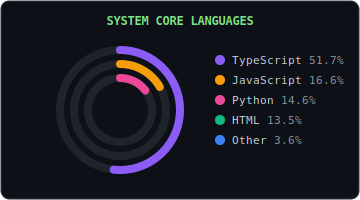
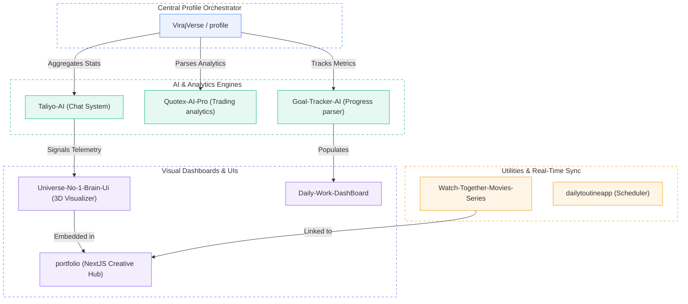

<!-- Header Section -->

  <picture>
    <source media="(prefers-color-scheme: dark)" srcset="dark.svg">
    <source media="(prefers-color-scheme: light)" srcset="light.svg">
    
  </picture>
  
  

    
    
        
    
  

<!-- Introduction -->

  <table border="0" cellpadding="0" cellspacing="0" width="100%">
    <tr>
      <td style="border-left: 3px solid #8b5cf6; border-right: 1px solid #30363d; border-top: 1px solid #30363d; border-bottom: 1px solid #30363d; border-radius: 4px; padding: 15px; background: #0d1117; font-family: monospace; font-size: 13px;  line-height: 1.5; font-style: italic; text-align: left;">
        "AI-focused Full Stack Developer with hands-on experience building production-grade systems across AI engineering, SaaS platforms, developer tools, and consumer applications."
      </td>
    </tr>
  </table>

---

##  Active Session Logs & System Status

<!-- START_SECTION:ai-diary -->

>  **Developer Active Session** (Updated <relative-time datetime="2026-07-23T08:40:41Z">2026-07-23T08:40:41Z</relative-time>):
> *"I pushed several updates and created a new feature branch for my Asphalt Legends Steering Wheel project alongside enhancements to the Universe No 1 Brain UI. I also actively updated my core VirajVerse repository and kicked off a new development branch for my portfolio platform."*

<!-- END_SECTION:ai-diary -->

[ Search past logs by custom date range](https://virajverseportfolio.vercel.app/diary)

<!-- START_SECTION:ai-diary-archive -->

  
 View Past Workspace Logs

  <ul>
    <li><strong>2026-07-23:</strong> Over the last six hours, I focused heavily on iterating and branching out my Asphalt Legends Steering Wheel project alongside updates to the Universe No 1 Brain UI. I also pushed key code updates and established a new branch across my core VirajVerse and VirajVersePortfolio repositories.</li>
    <li><strong>2026-07-22:</strong> I focused heavily on pushing active iterations and branching out new development for the Asphalt Legends Steering Wheel project alongside the Universe Brain UI. Concurrently, I deployed updates to my central VirajVerse repository and expanded the codebase for my personal portfolio.</li>
    <li><strong>2026-07-22:</strong> I spent the last few hours heavily iterating on my Asphalt Legends steering wheel controller project while pushing core updates across the VirajVerse codebase. To streamline upcoming features, I established dedicated development branches and pushed UI updates across my personal portfolio platform and the Universe Brain UI interface.</li>
    <li><strong>2026-07-22:</strong> I focused heavily on advancing my Asphalt Legends steering wheel project while pushing continuous updates across my VirajVerse portfolio platforms and UI systems. By creating targeted feature branches and committing iterative improvements, I refined core controller mechanics and updated my digital ecosystem.</li>
    <li><strong>2026-07-22:</strong> I spent an intensive session pushing multiple updates and branching out new developments for my Asphalt Legends steering wheel controller project. Alongside these hardware and software iterations, I refined the Universe Brain UI and deployed updates across my VirajVerse portfolio ecosystem.</li>
    <li><strong>2026-07-21:</strong> Over the last six hours, I actively pushed updates across my Asphalt Legends steering wheel project, Universe No. 1 Brain UI, and main VirajVerse ecosystem. I also initialized new feature branches to streamline incoming developments for both my core platform and personal portfolio.</li>
    <li><strong>2026-07-21:</strong> I am currently coding, learning new technologies, and building open-source projects!</li>
    <li><strong>2026-07-21:</strong> I focused on accelerating my development pipeline by pushing updates to my core VirajVerse projects, refining the Universe No 1 Brain UI, and branching out new iterations for my portfolio and the Asphalt Legends steering wheel controller.</li>
    <li><strong>2026-07-21:</strong> I focused on advancing the Ashphalt Legends steering wheel project by branching and committing multiple updates, alongside active development on the Universe No 1 Brain UI. I also pushed several iterations to my VirajVerse and VirajVersePortfolio repositories to ensure my core portfolio ecosystem is fully updated.</li>
  </ul>

<!-- END_SECTION:ai-diary-archive -->

---

##  Daily Coding Breakdown

<table border="0" cellpadding="0" cellspacing="0" width="100%">
  <tr>
    <td width="50%" valign="top" align="center" style="padding-right: 10px;">
      
    </td>
    <td width="50%" valign="top" align="center" style="padding-left: 10px;">
      
    </td>
  </tr>
</table>

<!-- WakaTime Text Data Target -->
<!--START_SECTION:waka-->
<!--END_SECTION:waka-->

---

##  Repository Ecosystem &amp; System Integration

---

##  Core Tech Stack & Tools

<table border="0" cellpadding="20" cellspacing="0" width="100%" style="border: 1px solid #30363d; border-radius: 8px; background: #0d1117; font-family: monospace; font-size: 13px; margin-bottom: 20px;">
  <tr>
    <td width="50%" valign="top" style=" line-height: 1.6; text-align: left; padding: 20px;">
      
 Core AI &amp; Product Engineering

      
LLM Gateway &amp; RAG  : ██████████ 100%

      
Context Orchestration: █████████░  90%

      
Multi-Agent Systems  : ████████░░  80%

    </td>
    <td width="50%" valign="top" style=" line-height: 1.6; text-align: left; border-left: 1px solid #30363d; padding: 20px; padding-left: 25px;">
      
 Backend &amp; Data Pipeline Metrics

      
API Design &amp; Logic   : █████████░  90%

      
Database Optimization : ████████░░  80%

      
DevOps &amp; Integrations : ███████░░░  70%

    </td>
  </tr>
</table>

<table border="0" cellpadding="0" cellspacing="0" width="100%">
  <tr>
    <td width="50%" valign="top" style="padding-right: 10px;">
      <h3 style="border-bottom: 1px solid #30363d; padding-bottom: 5px; color: #3b82f6;"> Frontend Architecture</h3>
      
Next.js, React, TypeScript, Tailwind CSS, Svelte, Angular, Redux, Zustand

    </td>
    <td width="50%" valign="top" style="padding-left: 10px;">
      <h3 style="border-bottom: 1px solid #30363d; padding-bottom: 5px; color: #ef4444;"> Backend & Database</h3>
      
Node.js, FastAPI, Python, NestJS, Express.js, Laravel, PostgreSQL, MongoDB, Redis

    </td>
  </tr>
  <tr>
    <td width="50%" valign="top" style="padding-right: 10px; padding-top: 15px;">
      <h3 style="border-bottom: 1px solid #30363d; padding-bottom: 5px; color: #10b981;"> AI/ML & Data Science</h3>
      
LLM APIs, LangChain, TensorFlow, PyTorch, Python, LLM System Design

    </td>
    <td width="50%" valign="top" style="padding-left: 10px; padding-top: 15px;">
      <h3 style="border-bottom: 1px solid #30363d; padding-bottom: 5px; color: #f59e0b;"> Cloud & DevOps</h3>
      
AWS, Google Cloud, Docker, Kubernetes, Terraform, GitHub Actions, Nginx

    </td>
  </tr>
</table>

---

##  Featured Projects

<table border="0" cellpadding="0" cellspacing="0" width="100%">
  <!-- Row 1 -->
  <tr>
    <td width="50%" valign="top" style="padding-right: 8px;">
      

        

          

            <h4 style="margin: 0; color: #58a6ff; font-size: 13.5px; font-weight: bold;"> Taliyo Technologies</h4>
            SaaS Platform • Web App
          

          
Enterprise marketing website and administrative dashboard for business operations. Integrated with database tables, automated invoice generation, client CRM, and UTM analytics tracking.

        

        

          <a href="https://www.taliyotechnologies.com" target="_blank" style="color: #4ade80; text-decoration: none; font-weight: bold;"> Visit Website</a>
        

      

    </td>
    <td width="50%" valign="top" style="padding-left: 8px;">
      

        

          

            <h4 style="margin: 0; color: #58a6ff; font-size: 13.5px; font-weight: bold;"> Universe #1 Brain UI</h4>
            3D Visualizer • Web App
          

          
High-fidelity 3D visual telemetry console for biological and cognitive intelligence mapping. Renders active network nodes and system metric overlays in real-time.

        

        

          <a href="https://versebrain.vercel.app/" target="_blank" style="color: #4ade80; text-decoration: none; font-weight: bold;"> Live Demo</a>
          |
          <a href="https://github.com/virajverse/Universe-No-1-Brain-Ui" target="_blank" style="color: #58a6ff; text-decoration: none; font-weight: bold;"> GitHub</a>
        

      

    </td>
  </tr>
  
  <!-- Row 2 -->
  <tr>
    <td width="50%" valign="top" style="padding-right: 8px; padding-top: 16px;">
      

        

          

            <h4 style="margin: 0; color: #58a6ff; font-size: 13.5px; font-weight: bold;"> Synapse AI</h4>
            AI Chat • Memory Assistant
          

          
Intelligent chatbot assistant featuring long-term memory capabilities. Dynamically extracts context from user queries to provide personalized, memory-driven answers.

        

        

          <a href="https://github.com/virajverse/Own-Chat-Gpt" target="_blank" style="color: #58a6ff; text-decoration: none; font-weight: bold;"> GitHub</a>
        

      

    </td>
    <td width="50%" valign="top" style="padding-left: 8px; padding-top: 16px;">
      

        

          

            <h4 style="margin: 0; color: #58a6ff; font-size: 13.5px; font-weight: bold;"> Taliyo Marketplace</h4>
            E-commerce • Booking Platform
          

          
Full-stack service booking and marketplace platform. Implements consumer-facing catalog features, WhatsApp-based checkout conversion hooks, and admin dashboard tables.

        

        

           Private Codebase
        

      

    </td>
  </tr>

  <!-- Row 3 -->
  <tr>
    <td width="50%" valign="top" style="padding-right: 8px; padding-top: 16px;">
      

        

          

            <h4 style="margin: 0; color: #58a6ff; font-size: 13.5px; font-weight: bold;"> Gesture OS</h4>
            OS Utility • Vision Controller
          

          
Webcam-based gesture control utility. Allows users to move their PC mouse cursor, click, double-click, and perform shortcuts using hand gestures.

        

        

          <a href="https://github.com/virajverse/Gesture-OS" target="_blank" style="color: #58a6ff; text-decoration: none; font-weight: bold;"> GitHub</a>
        

      

    </td>
    <td width="50%" valign="top" style="padding-left: 8px; padding-top: 16px;">
      

        

          

            <h4 style="margin: 0; color: #58a6ff; font-size: 13.5px; font-weight: bold;"> Tony (Small Friend)</h4>
            AI Companion • Desktop Tool
          

          
Interactive virtual desktop assistant. Monitors active screens to identify visual elements and answers user queries in real-time.

        

        

           Private Codebase
        

      

    </td>
  </tr>
</table>

   <em>Note: Access to private client repositories and case telemetry is restricted under NDA. Please contact me at <strong>virajsrivastav016@gmail.com</strong> to request credentialed access or schedule a code walk-through.</em>

---

##  Timeline &amp; Journey

<table border="0" cellpadding="0" cellspacing="0" width="100%" style="font-family: monospace; font-size: 13px;  line-height: 1.6; border-collapse: collapse;">
  <tr>
    <td width="15%" valign="top" style="color: #58a6ff; font-weight: bold; text-align: right; padding-right: 15px; border-right: 2px solid #30363d; padding-bottom: 20px;">
      2023 - Present
    </td>
    <td width="5%" valign="top" align="center" style="position: relative; padding-bottom: 20px;">
      ●
    </td>
    <td width="80%" valign="top" style="padding-left: 15px; padding-bottom: 20px; text-align: left;">
      <strong style="color: #7ee787;">Full-Stack Product Engineer (Freelance)</strong> 
      Designed and shipped 10+ production-grade SaaS platforms, multi-provider LLM gateways, and CRM/invoice automation systems. Optimized performance indicators (LCP/CDN caching) and improved conversion pipelines.
    </td>
  </tr>
  <tr>
    <td width="15%" valign="top" style="color: #58a6ff; font-weight: bold; text-align: right; padding-right: 15px; border-right: 2px solid #30363d; padding-bottom: 20px;">
      2022 - Present
    </td>
    <td width="5%" valign="top" align="center" style="position: relative; padding-bottom: 20px;">
      ●
    </td>
    <td width="80%" valign="top" style="padding-left: 15px; padding-bottom: 20px; text-align: left;">
      <strong style="color: #10b981;">Self-Taught Developer — Freelance Full Stack &amp; AI Development</strong> 
      Project-driven, hands-on learning focused on Full Stack Development and AI systems (STT, TTS, Computer Vision). Built real-world web applications, backend APIs, databases, Electron-based desktop apps, and AI-powered automation aligned with client and product requirements.
    </td>
  </tr>

  <tr>
    <td width="15%" valign="top" style="color: #58a6ff; font-weight: bold; text-align: right; padding-right: 15px; border-right: 2px solid #30363d; padding-bottom: 20px;">
      2023
    </td>
    <td width="5%" valign="top" align="center" style="position: relative; padding-bottom: 20px;">
      ●
    </td>
    <td width="80%" valign="top" style="padding-left: 15px; padding-bottom: 20px; text-align: left;">
      <strong>Completed Class XII (Higher Secondary)</strong>
    </td>
  </tr>
  <tr>
    <td width="15%" valign="top" style="color: #58a6ff; font-weight: bold; text-align: right; padding-right: 15px; border-right: 2px solid #30363d;">
      2021
    </td>
    <td width="5%" valign="top" align="center" style="position: relative;">
      ●
    </td>
    <td width="80%" valign="top" style="padding-left: 15px; text-align: left;">
      <strong>Completed Class X (Secondary School)</strong>
    </td>
  </tr>
</table>

---

##  Currently Listening To

  

---

##  Let's Connect & Collaborate

I'm always open to discussing new projects, creative ideas, or opportunities to be part of your vision. Feel free to reach out to me through any of the platforms below:

  
  
  
  

I try to respond to all messages within 24-48 hours.

---

##  Thank You!

Thank you for visiting my profile! Feel free to reach out if you'd like to collaborate or just chat about tech!

  <h3>Made with  by Viraj</h3>
  
© 2026 | All Rights Reserved

  
  

    
  

  
  

    <a href="#top">Back to top </a>
  

